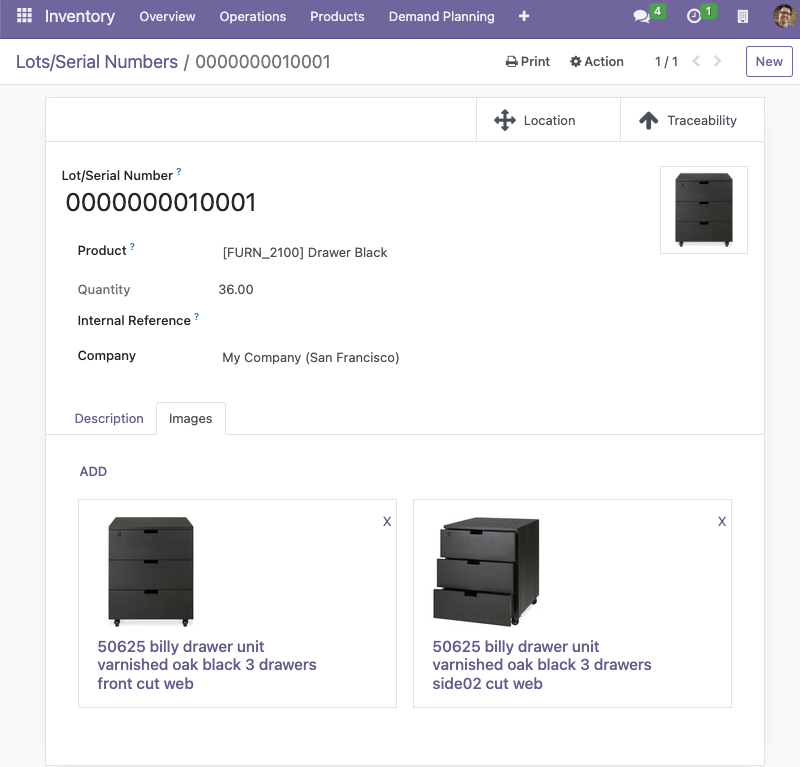

- Go to Inventory > Products > Lots / Serial Numbers and choose a stock lot. 
- Go to the Images tab. Add a new image or edit the existing ones. 
- Refresh the page. 
- The first image in the collection is the main image for the stock lot.

